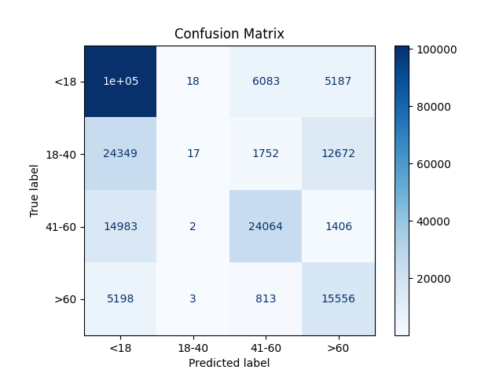

# 🧑‍💻 Deep Learning Age Estimation with [CoAtNet](https://arxiv.org/abs/2106.04803)

This project is part of the **Deep Learning for Practitioners** course at TU Chemnitz.  
The goal is to predict age groups from face images using advanced neural architectures.

---

## 📁 Project Structure

- `train.py`: Model training script using **CoAtNet**.
- `evaluate.py`: Evaluation script on UTKFace dataset.
- `confusion_matrix.py`: Script for visualizing confusion matrix.
- `dataset.py`: Dataset loading utilities.
- `age_model_classification.pth`, `coatnet_finetuned.pth`: Saved model weights.
- `confusion_matrix_result.png`: Result image of confusion matrix.

---

## 🎯 Task

Classify faces into 4 age groups:

- `<18`
- `18-40`
- `41-60`
- `>60`

---

## ⚙️ Methods

### Model Architecture

- Used **CoAtNet** model with 4 output classes.
- Implemented fine-tuning strategy:
  - Pre-trained on general images.
  - Then fine-tuned on UTKFace dataset.

### Data Preparation

- Used UTKFace dataset with resized and normalized images.
- Stratified splitting to handle class imbalance.
- Applied basic augmentations (resize, horizontal flip).

---

## ✅ Results

### Evaluation Accuracy

- **Overall Accuracy**: ~52.79%

### Confusion Matrix Analysis

The confusion matrix shows that the model performs well on younger age groups, especially `<18` and `18-40`, with high correct prediction rates.

However, for middle and older age groups (`41-60`, `>60`), there is noticeable confusion. Many individuals in the `41-60` group are misclassified as either `18-40` or `>60`.

This suggests that distinguishing older age-related facial features is more challenging for the model. The model tends to predict younger classes more confidently.



---

## 🗺️ Next Steps

- Improve accuracy on older classes by:
  - Adding more samples for `41-60` and `>60`.
  - Using targeted data augmentation (e.g., wrinkle simulation, style transfer).
- Explore self-supervised pre-training with AgeDB dataset.
- Integrate generative and agentic AI strategies for augmenting data and automatic annotation.

---

## 🌀 How to Run

```bash
# Create virtual environment
python -m venv .venv
source .venv/Scripts/activate     # Windows
# or
source .venv/bin/activate         # macOS/Linux

# Install dependencies
pip install -r requirements.txt

# Train model
python train.py

# Evaluate model
python evaluate.py

# Plot confusion matrix
python confusion_matrix.py
